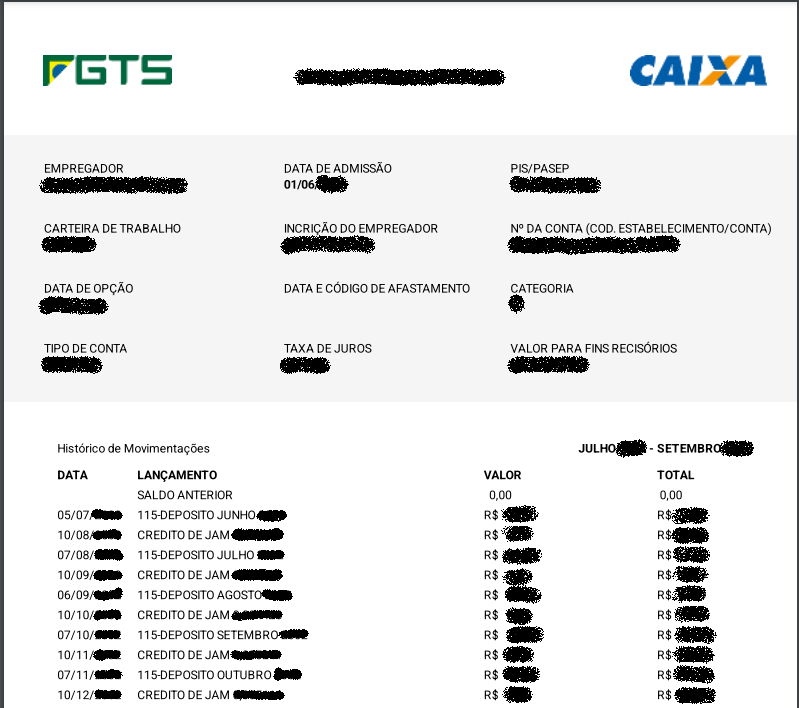

# PdfToXls
**O que faz:**

PdfToXls é uma ferramenta em .NET que converte arquivos PDF em planilhas XLSX.

**Funcionalidades:**

Inicialmente o projeto tem o obsetivo auxiliar trabalhadores na conferencia dos extratos gerados pelo APP do FGTS.

A Aplicação efetua a leitura do arquivo PDF e gera um XLSX.

**Benefícios:**

Simplifica a conferencia de depósitos do FGTS.

Economiza tempo e esforço manual.

**Como usar:**

Instale o .NET 7.

Baixe e compile o código-fonte C#.

Execute o aplicativo e selecione o arquivo PDF a ser convertido.

**Links Úteis:**

Lib de conversão PDF to TXT: https://github.com/UglyToad/PdfPig

Lib para geração de XLSX: https://www.nuget.org/packages/NPOI

**Observações:**

Este projeto está em desenvolvimento ativo.

Novas funcionalidades e melhorias serão adicionadas futuramente.

Esse projeto foi baseado na leitura do extrato

**Contribuições:**

Se você encontrar algum problema, por favor, abra um issue no GitHub.

Sugestões de melhorias e novas funcionalidades são bem-vindas.

Obrigado por usar o PdfToXls!

Palavras-chave: conversor pdf para xlsx, c#, extrair dados de pdf, planilha, análise de dados.

